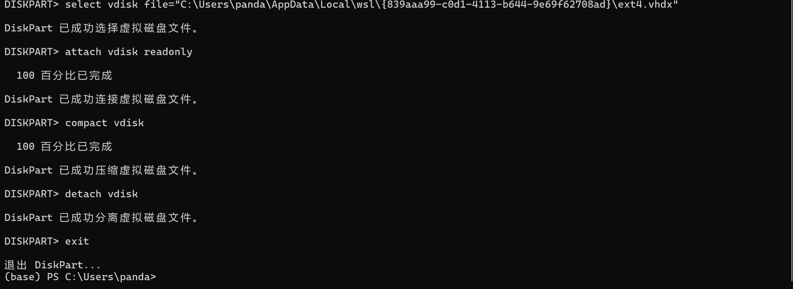
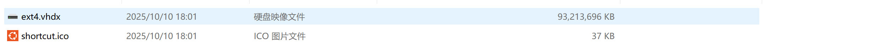

# wsl2 释放空间流程

**在 wsl2 中删除文件并不会释放空间，这样就会导致ext4.vhdx越来越大，磁盘爆满。以下是 wsl2 释放空间的流程。**

**在此之前，可以在 wsl2 中删除或转移不需要的文件。**

## 1.关闭 wsl2

**在 PowerShell（管理员模式）里运行下命令,确保 wsl2 完全关闭。**

```bash
wsl --shutdown
```


## 2.找到 wsl2 磁盘文件

**我的路径是**
 *C:\Users\panda\AppData\Local\wsl\{839aaa99-c0d1-4113-b644-9e69f62708ad}/ext4.vhdx*

## 3.然后依次执行以下命令（注意把路径替换成自己的）

```bash
# 启动 diskpart
diskpart
# 指定虚拟磁盘
 select vdisk file="C:\Users\panda\AppData\Local\wsl\{839aaa99-c0d1-4113-b644-9e69f62708ad}/ext4.vhdx" 
# 以只读方式挂载磁盘，防止数据损坏
 attach vdisk readonly
# 执行压缩操作，这会释放 wsl2 内部删除文件后空出的空间
 compact vdisk
# 分离磁盘
 detach vdisk
# 退出 diskpart
 exit
```



## 4.检查

**可以在文件夹中看到 wsl2 变小了。**

